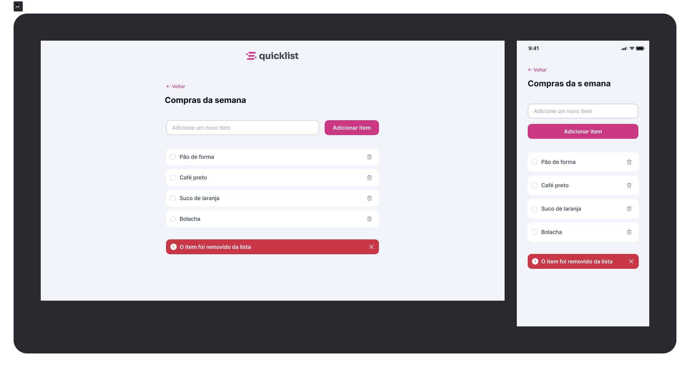

## Lista de Compras/Tarefas
____

#### Criação de uma página responsiva de lista de Items feita dinamicamente com JavaScritp!

###### o Usuário digita os items, que podem ser adicionados e excluidos a qualquer momento! Alem disso, quando marcado o item ficará cortado por uma linha mostrando que a atividade foi concluida alem de ter um alerta na pagina informando isso a ele!
___

##### Segue a página modelo do projeto!

